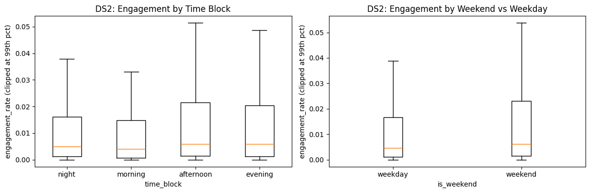
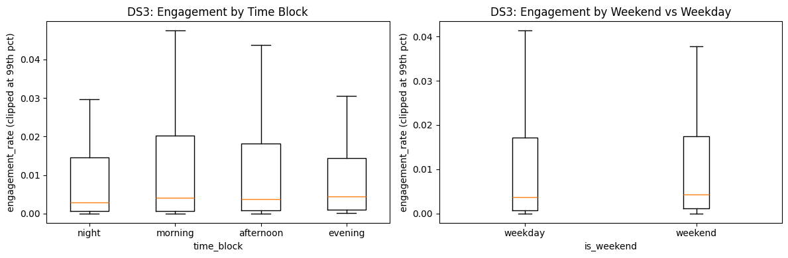
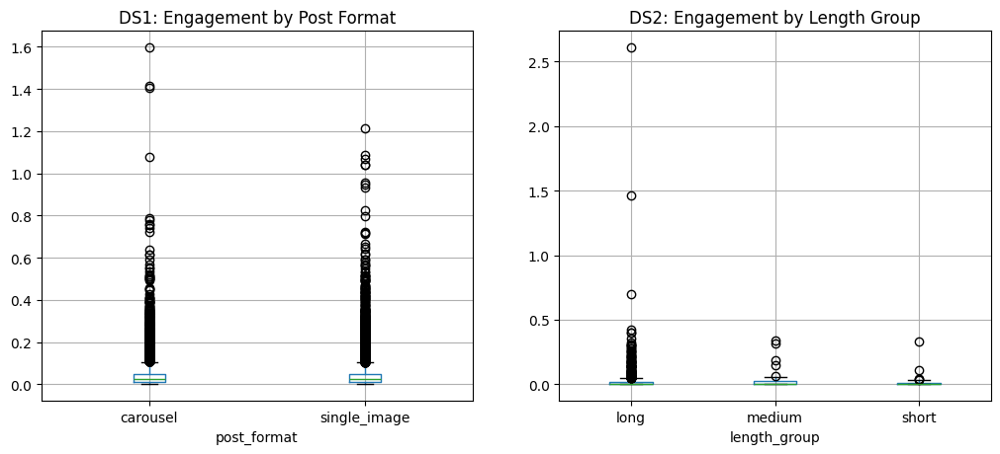
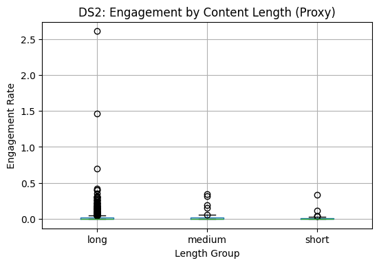
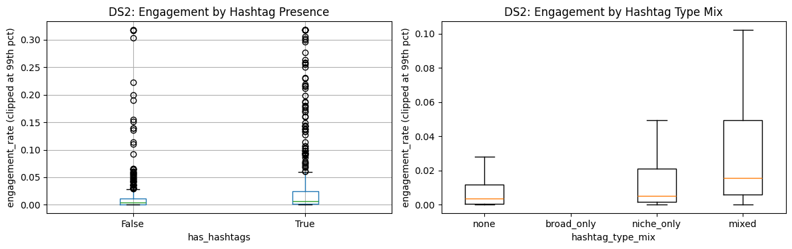
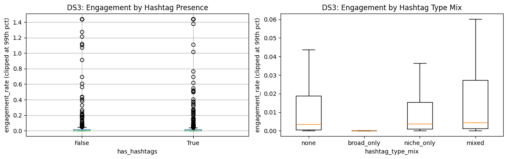

# Instagram Virality Analytics (SC3021)

## Name
Instagram Virality Analytics (SC3021-SDAD-DS)

## Description
This project analyzes social media post characteristics and their relationship to engagement and virality, with a focus on Instagram-style datasets. The workflow covers data understanding, cleaning, feature engineering, and exploratory analysis inside `main.ipynb`.

The objective is to identify which post-level factors (for example: hashtag usage, post timing, content type, follower base, and engagement metrics) are associated with higher performance.

Background references used for this coursework are included in `references/`, including:
- `references/SC3021_Lab_Manual.pdf`
- `references/lab_project_intro_slides.pdf`

### Features
- Multi-dataset preprocessing pipeline (`df_ds1`, `df_ds2`, `df_ds3`)
- Data cleaning for invalid negatives and missing values
- Derived fields such as `hashtag_count`, `post_hour`, and `engagement_rate`
- Notebook-based exploratory analysis for virality-related patterns

## Visuals







## Installation
### Requirements
- Python 3.10 or above
- Jupyter Notebook or JupyterLab
- Core libraries: `pandas`, `numpy`, `matplotlib` (and any others used in the notebook)

### Setup Steps
1. Clone the repository.
2. Create and activate a Python virtual environment.
3. Install dependencies.
4. Launch Jupyter and open `main.ipynb`.

Example:

```bash
git clone <your-repo-url>
cd SC3021-SDAD-DS
python -m venv .venv
# Windows PowerShell:
.venv\Scripts\Activate.ps1
# macOS/Linux:
# source .venv/bin/activate
pip install pandas numpy matplotlib jupyter
jupyter notebook
```

## Usage
1. Place or verify datasets under `datasets/`.
2. Open `main.ipynb`.
3. Run cells in order:
   - data loading
   - cleaning and imputation
   - feature enrichment
   - analysis and interpretation

Minimal usage example in notebook workflow:
- Build cleaned dataframes (`df_ds1`, `df_ds2`, `df_ds3`)
- Handle missing values and invalid negatives
- Compute derived metrics such as `engagement_rate_for_rq1`

## Support
For questions or issues:
- Open an issue in this repository
- Contact the project team/class group directly

## Authors and acknowledgment
- SC3021 project team members
- NTU course instructors and teaching staff for project guidance